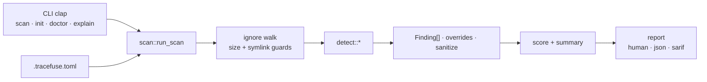

# Tracefuse

<p align="center">
  
</p>

<p align="center">
  <strong>Declared vs real.</strong> Offline supply-chain / pipeline truth scanner.
</p>

<p align="center">
  <a href="https://github.com/FounderB/Tracefuse/actions"></a>
  
  
  
  
</p>

Lockfiles drift. Dockerfiles float on `:latest`. CI trusts the wrong trigger. A single `postinstall` can phone home. Tracefuse walks a repo and surfaces gaps between **what you declare** and **what actually ships** — secrets, risky scripts, lockfile drift, container smells, CI anti-patterns, credential files, and light dependency heuristics.

No network required for a default scan. Secrets in reports are redacted. SARIF plugs into GitHub Code Scanning.

```
╔══════════════════════════════════════════════════════════╗
║                        TRACEFUSE                         ║
║           declared vs real · supply-chain truth          ║
╚══════════════════════════════════════════════════════════╝

  score   0  ░░░░░░░░░░░░░░░░░░░░
  CRIT 2  HIGH 9  MED 5  LOW 0  INFO 0
```

## Install

**From source** (recommended today):

```bash
git clone https://github.com/FounderB/Tracefuse.git
cd Tracefuse
cargo install --path .
```

**One-shot** without installing:

```bash
cargo run --release -- scan .
```

Requires Rust **1.74+**.

## 60-second wow demo

All values under `examples/demo-vulnerable/` are labeled **FAKE / EXAMPLE**.

```bash
cargo build --release

# Human report — score, badges, redacted evidence, next steps
./target/release/tracefuse scan examples/demo-vulnerable

# Machine outputs for CI / Code Scanning
./target/release/tracefuse scan examples/demo-vulnerable --json
./target/release/tracefuse scan examples/demo-vulnerable \
  --sarif /tmp/tracefuse.sarif --fail-on high

# DX
./target/release/tracefuse doctor .
./target/release/tracefuse explain ci/oidc-misuse
```

Expect findings across **secrets**, **scripts**, **lockfile**, **dockerfile**, **ci**, **env_files**, and **deps**. Exit `1` when policy fails; exit `2` on tool error.

### New in 0.2

```bash
# Only files changed vs HEAD (+ untracked)
./target/release/tracefuse scan . --git-diff

# Custom regex in .tracefuse.toml
# [[custom_rules]]
# id = "corp-token"
# title = "Corp internal token"
# pattern = '(?i)\bCORP_[A-Z0-9]{24}\b'
# severity = "high"
```

## Why not `grep` for secrets?

| | Naive `grep` / regex dump | Tracefuse |
|---|---|---|
| Scope | Token strings only | Secrets **plus** scripts, lockfiles, Docker, CI, env files, deps |
| Output | Raw matches (easy to paste real keys into tickets) | **Redacted** evidence in human / JSON / SARIF |
| Policy | Shell glue + exit-code hacks | `--fail-on info\|low\|medium\|high\|critical` |
| CI | Ad-hoc | Copy-paste Actions + **SARIF 2.1.0** upload |
| Safety | Often online tools or unscoped walks | **Offline** default; symlink escapes rejected; size caps |

Use Tracefuse when you need a single local gate that answers “what does this repo *actually* risk?” — not just “does this line look like a key?”

## Features

| Detector | What it catches |
|---|---|
| **secrets** | Private keys, AWS / GCP / GitHub PAT / Stripe / Slack (+ webhooks) / OpenAI-like tokens, high-entropy assignments (redacted) |
| **scripts** | Dangerous npm lifecycle scripts (`postinstall` + `curl\|bash`, `eval`, …) |
| **lockfile** | Missing locks / manifest vs lock drift (npm, Cargo, Go) |
| **dockerfile** | `:latest` / unpinned bases, secrets in `ENV`, `ADD http`, `curl\|sh`, root / privileged patterns |
| **ci** | `pull_request_target`, OIDC/`id-token` misuse, `curl\|bash`, plaintext secrets, `write-all` |
| **env_files** | `.env`, credential JSON, PEM/keys, kubeconfig-style files |
| **deps** | Known-bad / typosquat-ish names, remote URL dependencies |

Also: health score, `tracefuse init` → `.tracefuse.toml`, `doctor` / `explain`, severity overrides, quiet mode for CI.

## CLI

```bash
tracefuse init [--force] [path]           # write .tracefuse.toml
tracefuse doctor [path]                   # config / ignore / redaction health check
tracefuse explain <rule-id>               # remediation + why (e.g. ci/pull-request-target)
tracefuse scan [path]                     # human report (default path: .)
tracefuse scan . --json                   # JSON to stdout
tracefuse scan . --sarif out.sarif        # SARIF 2.1.0 file
tracefuse scan . --fail-on high           # CI gate
tracefuse scan . -c custom.toml -q        # custom config + quiet
```

**Exit codes:** `0` clean / below threshold · `1` policy fail · `2` tool error.

Default `fail_on` in config is `high` (overridable via `--fail-on` or `.tracefuse.toml`).

## Architecture



Details: [docs/ARCHITECTURE.md](docs/ARCHITECTURE.md) · [docs/DETECTORS.md](docs/DETECTORS.md) · [docs/CONFIGURATION.md](docs/CONFIGURATION.md)

## GitHub Actions (copy-paste)

Minimal scan + SARIF upload. Full guide: [docs/GITHUB_ACTION.md](docs/GITHUB_ACTION.md). Thin composite action: [`action/action.yml`](action/action.yml).

```yaml
name: tracefuse
on:
  pull_request:
  push:
    branches: [main, master]

permissions:
  contents: read
  security-events: write

jobs:
  scan:
    runs-on: ubuntu-latest
    steps:
      - uses: actions/checkout@v4
      - uses: dtolnay/rust-toolchain@stable
      - name: Install Tracefuse
        run: cargo install --path . --locked
      - name: Scan
        run: tracefuse scan . --sarif tracefuse.sarif --fail-on high -q
      - name: Upload SARIF
        if: always()
        uses: github/codeql-action/upload-sarif@v3
        with:
          sarif_file: tracefuse.sarif
```

Or, when this repo is checked out as the Action source:

```yaml
- uses: ./action
  with:
    fail-on: high
    sarif-path: tracefuse.sarif
```

## Security promises

- **Offline by default** — detectors only read local files; no outbound network for a normal scan.
- **Redaction** — secret-like evidence is redacted at detect time and again via a global sanitize pass before human, JSON, and SARIF emit.
- **Traversal care** — walker + canonicalize stay under the scan root; parent-dir escapes rejected.
- **Size caps** — `max_file_bytes` skips huge blobs.
- Demo fixture uses clearly labeled **FAKE/EXAMPLE** values only.

See [SECURITY.md](SECURITY.md).

## License

MIT © FounderB — [LICENSE](LICENSE).

## Contributing

[CONTRIBUTING.md](CONTRIBUTING.md) · [CHANGELOG.md](CHANGELOG.md) · [CODE_OF_CONDUCT.md](CODE_OF_CONDUCT.md)
