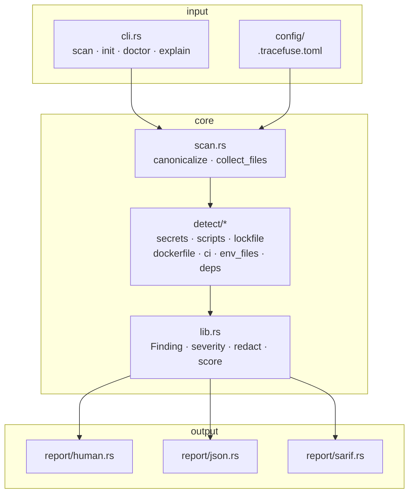

# Architecture

Tracefuse is a single Rust binary. It walks a project tree offline and runs pure detectors — no network, no agent runtime.

## Modules

| Path | Role |
|------|------|
| `src/cli.rs` | Clap definitions (`scan`, `init`, `doctor`, `explain`) |
| `src/config/` | `.tracefuse.toml` load/write, `fail_on`, detector toggles |
| `src/scan.rs` | Root canonicalize, ignore walk, detector orchestration |
| `src/detect/` | One module per detector family |
| `src/report/` | Human / JSON / SARIF emitters |
| `src/rules.rs` | Rule catalog for `explain` / doctor |
| `src/lib.rs` | Shared `Finding`, severity, redaction, scoring |
| `src/main.rs` | Wire-up, exit codes `0` / `1` / `2` |

## Data flow

1. Resolve scan root (`scan [path]`, default `.`).
2. Load config (`.tracefuse.toml` or `-c` / `--config`); CLI `--fail-on` overrides.
3. Collect files via `ignore` (respects `.gitignore`), skip ignore-path fragments, size-capped files, and symlink escapes outside the root.
4. Run enabled detectors; each returns `Vec<Finding>` with redacted evidence.
5. Apply `[severity_overrides]`, then `sanitize_findings` (global secret scrub).
6. Sort by severity, compute health score (0–100) and next steps.
7. Emit: human (unless `-q` / `--quiet`), optional `--json` to stdout, optional `--sarif <FILE>`.

## Safety invariants

1. **Offline default** — detectors only read local files.
2. **Redaction** — `redact_secret` / ENV redactors before any emit path.
3. **Traversal care** — canonicalize must stay under scan root; `..` components rejected.
4. **Size caps** — `max_file_bytes` (default 2 MiB) skips huge blobs.
5. **Stable exit codes** — `0` clean/below threshold · `1` policy fail · `2` tool error.

## Extending

1. Add `scan(...) -> Result<Vec<Finding>>` under `src/detect/`.
2. Wire it in `scan::run_scan` behind a `DetectorToggles` flag and default `EXAMPLE_CONFIG`.
3. Document in [DETECTORS.md](DETECTORS.md).
4. Cover with unit tests + a contract in `tests/cli_integration.rs`.
